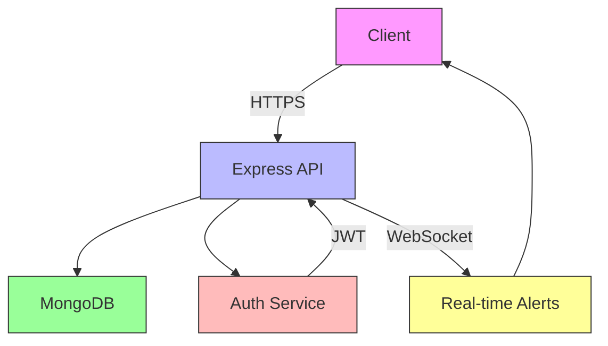

# Technical Architecture

## System Overview



### Components
1. **Client**
   - React SPA with responsive design
   - Service workers for offline capability
   - Secure local storage for auth tokens

2. **API Layer**
   - RESTful endpoints
   - WebSocket for real-time updates
   - Rate limiting and request validation

3. **Database**
   - MongoDB for flexible schema
   - Geospatial indexing for location queries
   - Automatic backups and replication

## Data Model

View the interactive database diagram on [dbdiagram.io](https://dbdiagram.io/d) for the complete schema and relationships.

## Security Architecture

### Authentication & Authorization
1. **JWT Implementation**
   - Access tokens (15min expiry)
   - Refresh tokens (7 day expiry)
   - Secure, HTTP-only cookies
   - CSRF protection

2. **Data Protection**
   - Field-level encryption for sensitive data
   - Input sanitization
   - Rate limiting (100 requests/15min)
   - CORS whitelisting

3. **Secure Communication**
   - TLS 1.3
   - HSTS headers
   - Content Security Policy
   - XSS protection headers

4. **Privacy Controls**
   - Minimal data collection
   - Automatic data retention policies
   - Right to be forgotten implementation

### Security Headers
```http
Strict-Transport-Security: max-age=31536000; includeSubDomains
X-Content-Type-Options: nosniff
X-Frame-Options: DENY
Content-Security-Policy: default-src 'self';
X-XSS-Protection: 1; mode=block
Referrer-Policy: no-referrer
```
